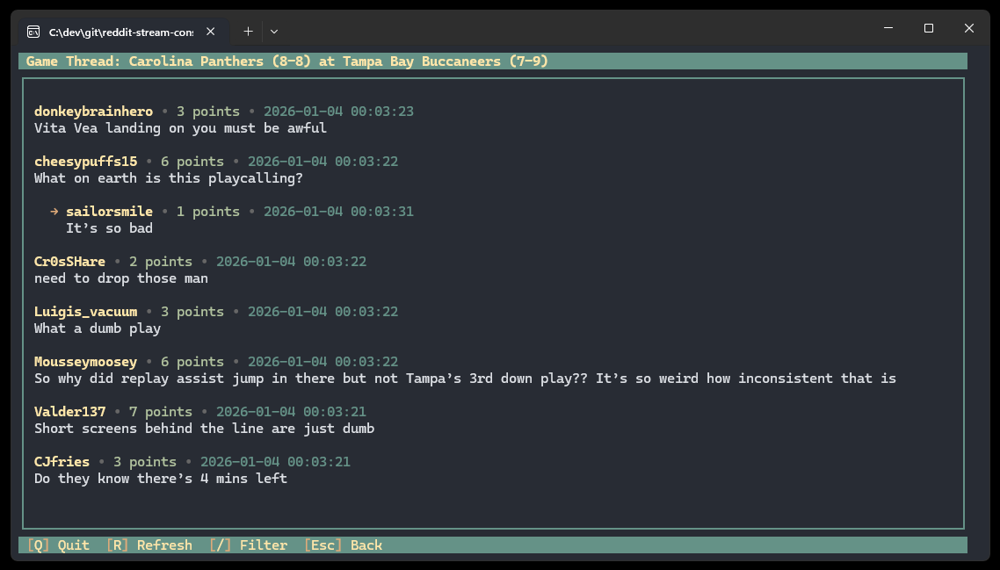

# reddit-stream-console

Terminal-based Reddit comment streamer. Like reddit-stream.com, but for people who prefer their social media in ASCII.



## Features

- Real-time comment streaming
- Live comment filtering
- Auto-scrolling with manual override
- Keyboard-driven interface
- Color-coded comments

## Quick Start

```bash
git clone https://github.com/fenneh/reddit-stream-console.git
cd reddit-stream-console
./build.sh  # or build.ps1 on Windows
```

Run the binary:

```bash
./bin/reddit-stream-console
```

No Reddit API credentials are required. Optional: set `REDDIT_USER_AGENT` in `.env` or your shell for better API hygiene.

## Docker

```bash
docker build -t reddit-stream-console .
docker run -it --env-file .env reddit-stream-console
```

## Windows EXE

```powershell
.\build.ps1
.\bin\reddit-stream-console.exe
```

## Controls

| Key | Action |
|-----|--------|
| `/` | Filter comments |
| `r` | Refresh |
| `end` | Scroll to bottom |
| `escape` | Menu/exit filter |
| `backspace` | Go back |
| `q` | Quit |

## License

MIT
