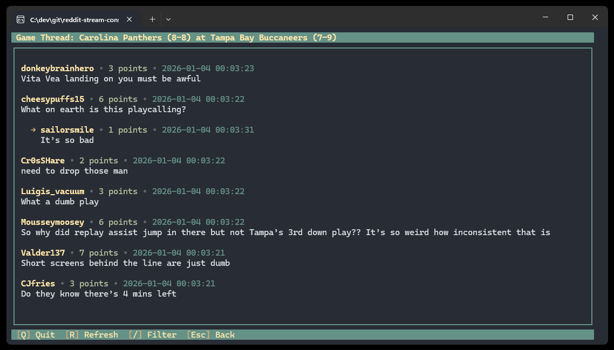

# reddit-stream-console

[](https://github.com/fenneh/reddit-stream-console/actions/workflows/build.yml)
[](https://github.com/fenneh/reddit-stream-console/releases/latest)
[](https://go.dev/)
[](LICENSE)

Terminal-based Reddit comment streamer built with Go and [tview](https://github.com/rivo/tview). Like reddit-stream.com, but in your terminal.



## Download

Grab the latest binary for your platform from [Releases](https://github.com/fenneh/reddit-stream-console/releases).

Requires your own free Reddit API credentials - see Configuration below.

## Features

- Real-time comment streaming with auto-refresh
- Live comment filtering
- Threaded comment display
- Keyboard-driven interface

## Building from Source

```bash
cd go
go build -o bin/reddit-stream-console ./cmd/reddit-stream-console
./bin/reddit-stream-console
```

## Controls

| Key | Action |
|-----|--------|
| `j/k` or `↑/↓` | Navigate |
| `Enter` | Select |
| `/` | Filter comments |
| `r` | Refresh comments |
| `t` | Cycle theme (saved to `app_config.json`) |
| `h` / `v` | Split view (horizontal / vertical) |
| `Tab` | Switch active pane (split mode) |
| `Esc` | Go back |
| `q` | Quit |

## Configuration

The app works out of the box with sensible defaults (soccer, NFL, and FantasyPL match threads). To customize the menu, create a `config/menu_config.json` file.

Config file search order:
1. `~/.reddit-stream-console/config/menu_config.json` (home directory)
2. Next to the executable
3. One directory above the executable
4. Two directories above the executable

If no config file is found, built-in defaults are used.

See `config/menu_config.json` for an example configuration.

### Reddit API credentials

Reddit no longer allows unauthenticated access to the `www.reddit.com/*.json`
endpoints this app used to rely on, so it now authenticates against Reddit's
official OAuth API instead. You'll need your own app credentials:

1. Create an app at [reddit.com/prefs/apps](https://www.reddit.com/prefs/apps)
   ("create app"). Pick type **"installed app"** (no secret) unless you already
   have a "script" type app, which also works.
2. Copy `.env.example` to `.env` (same directory as the executable - searched using
   the same locations as `config/menu_config.json` above) and set
   `REDDIT_CLIENT_ID` (and `REDDIT_CLIENT_SECRET` if using a script-type app).

### Themes

Set `theme` in `config/app_config.json` to one of the bundled palettes:

```json
{
    "debug_logging": false,
    "theme": "catppuccin-mocha"
}
```

Available themes:

- `default` (warm cream / sage / teal)
- `catppuccin-mocha`, `catppuccin-macchiato`, `catppuccin-frappe`, `catppuccin-latte`
- `dracula`
- `nord`
- `gruvbox-dark`
- `tokyo-night`

An empty or unknown name falls back to `default`.

## License

MIT
