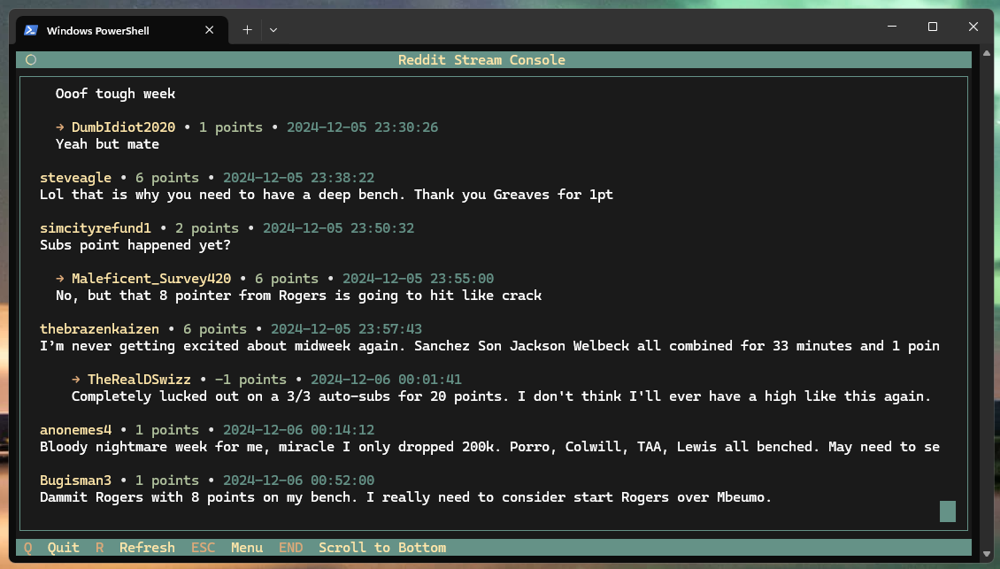

# Reddit Stream Console

A terminal-based Reddit thread and comment streaming application that allows you to follow live discussions in real-time. Perfect for following live sports events, match threads, and other real-time discussions.



## Features

- Real-time comment streaming from Reddit threads
- Support for multiple subreddits and thread types:
  - Soccer match threads and post-match discussions
  - NFL game threads and post-game discussions
  - Fantasy Premier League (FPL) rant threads
- Smart thread discovery using flairs and title matching
- Clean, interactive terminal UI with color coding
- Automatic thread updates
- Cross-platform support (Windows, Linux, macOS)

## Prerequisites

- Python 3.8 or higher
- Reddit API credentials (client ID and secret)

## Installation

1. Clone the repository:
```bash
git clone https://github.com/fenneh/reddit-stream-console.git
cd reddit-stream-console
```

2. Create a virtual environment and install dependencies:
```bash
# Windows
python -m venv venv
.\venv\Scripts\activate
pip install -r requirements.txt

# Linux/macOS
python3 -m venv venv
source venv/bin/activate
pip install -r requirements.txt
```

3. Create a `.env` file in the project root with your Reddit API credentials:
```env
REDDIT_CLIENT_ID=your_client_id_here
REDDIT_CLIENT_SECRET=your_client_secret_here
```

To get Reddit API credentials:
1. Visit https://www.reddit.com/prefs/apps
2. Click "create another app..."
3. Select "script"
4. Fill in the required information
5. Use the generated client ID and secret in your `.env` file

## Usage

1. Activate the virtual environment:
```bash
# Windows
.\venv\Scripts\activate

# Linux/macOS
source venv/bin/activate
```

2. Run the application:
```bash
# Windows
python reddit_stream.py

# Linux/macOS
python3 reddit_stream.py
```

### Navigation

- Use arrow keys to navigate the menu
- Press Enter to select a thread
- Press Q to quit the current view/application
- Press R to refresh the thread list

## Configuration

Thread types and their settings are configured in `config/menu_config.json`. You can customize:
- Thread titles in the menu
- Subreddits to search
- Flairs to match
- Time windows for thread discovery
- Title patterns to include/exclude

Example configuration:
```json
{
    "menu_items": [
        {
            "title": "/r/soccer match-threads",
            "type": "soccer_match",
            "subreddit": "soccer",
            "flair": ":Match_thread:Match Thread",
            "max_age_hours": 6,
            "limit": 50
        }
    ]
}
```

## Project Structure

- `reddit_stream.py`: Main application and UI logic
- `thread_finder.py`: Reddit thread discovery and filtering
- `config/menu_config.json`: Thread type configurations
- `requirements.txt`: Python dependencies
- `.env`: Reddit API credentials (not tracked in git)

## Dependencies

- asyncpraw (7.8.0): Async Reddit API wrapper
- aiohttp (3.9.1): Async HTTP client/server
- python-dotenv (1.0.0): Environment variable management
- windows-curses (2.4.0): Windows-compatible terminal UI

## Contributing

1. Fork the repository
2. Create a feature branch (`git checkout -b feature/amazing-feature`)
3. Commit your changes (`git commit -m 'Add amazing feature'`)
4. Push to the branch (`git push origin feature/amazing-feature`)
5. Open a Pull Request

## License

This project is licensed under the MIT License - see the [LICENSE](LICENSE) file for details.

## Acknowledgments

- [PRAW](https://praw.readthedocs.io/) for the Reddit API wrapper
- Reddit communities for providing the content
- All contributors who help improve this project
